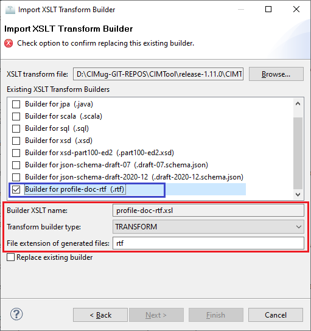

# profile-doc-rtf.xsl

This builder currently ships with CIMTool.

## Builder Description

The **sql.xsl** builder generates an ANSI SQL compliant database script that currently conforms to a following subset of ANSI defined database types:

```
{
  CHAR  [VARYING] (size)
 | INTEGER
 | DOUBLE PRECISION
}
```

An sample extract of a generated DDL script appears next and illustrates the inclusion of comments and descriptions as defined within a **CIMTool** ```owl``` profile:

``` sql
-- Schema for ComModuleConfig
-- Generated by CIMTool http://cimtool.org

-- Records activity for an entity at a point in time; activity may be for
-- an event that has already occurred or for a planned activity.
CREATE TABLE "ActivityRecord"
(
    "mRID" CHAR VARYING(30) NOT NULL UNIQUE,
    -- Date and time this activity record has been created (different from the
    -- 'status.dateTime', which is the time of a status change of the associated
    -- object, if applicable).
    "createdDateTime" CHAR VARYING(30),
    -- Reason for event resulting in this activity record, typically supplied
    -- when user initiated.
    "reason" CHAR VARYING(30),
    -- Severity level of event resulting in this activity record.
    "severity" CHAR VARYING(30),
    -- Type of event resulting in this activity record.
    "type" CHAR VARYING(30),
    -- Information on consequence of event resulting in this activity record.
    "status"CHAR VARYING(30)
);

-- Usage for an asset model.
CREATE TABLE "AssetModelUsageKind" ( "name" CHAR VARYING(30) UNIQUE );
-- Asset model is intended for use in customer substation.
INSERT INTO "AssetModelUsageKind" ( "name" ) VALUES ( 'customerSubstation' );
-- Asset model is intended for use in distribution overhead network.
INSERT INTO "AssetModelUsageKind" ( "name" ) VALUES ( 'distributionOverhead' );
-- Asset model is intended for use in underground distribution network.
INSERT INTO "AssetModelUsageKind" ( "name" ) VALUES ( 'distributionUnderground' );
-- Other kind of asset model usage.
INSERT INTO "AssetModelUsageKind" ( "name" ) VALUES ( 'other' );
...
...
...
```

## XSLT Version

This builder is XSLT 1.0 compliant.

## Author

Todd Viegut [@tviegut] on behalf of UCAIug.

## Submission Date

19-Aug-2022

## Builder NTE Configuration

Given this builder ships with CIMTool the below screenshot highlights the existing NTE (Name/Type/Extension) settings for the builder.  We strongly recommend that you do not import customized versions of this shipped builder over the original in your local CIMTool installation. Doing so will force regeneration of any existing builder-generated artifacts for projects in your workspace that have this builder enabled.

The recommended best practice is to rename the builder file  (from ```profile-doc-rtf.xsl``` to ```custom-profile-doc-rtf.xsl``` for example) before importing. On import this will be interpreted as a new builder and you will be allowed to enter values in the Type and Extension fields.

>*NOTE: </br>CIMTool requires that file extensions be unique and will prevent you from entering an extension already assigned to a builder. This is because an artifact's name is derived by concatenating the base name of the CIMTool ```.owl``` profile with the file extension assigned to the builder. Therefore, a unique file extension must be assigned to each builder when imported. The file extension for a builder can be modified later from with the "Maintain XSLT Transform Builders" screen.*



## License

This builder is released under the [Apache 2.0](../../LICENSE) license and was developed under sponsorship of the UCAIug.
