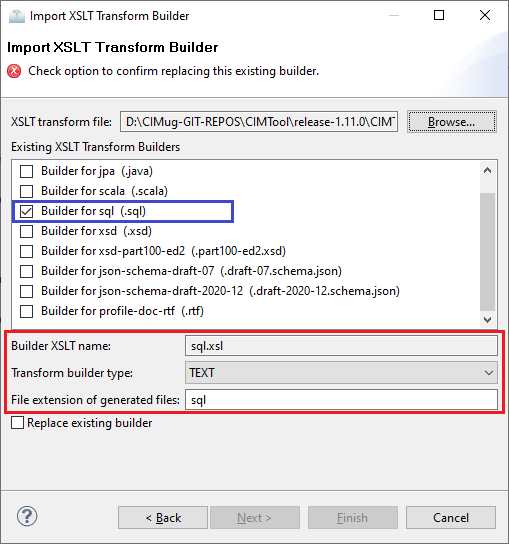

# sql.xsl

This builder currently ships with CIMTool.

## Builder Description

The **[sql.xsl](sql.xsl)** builder generates an ANSI SQL compliant database script that currently conforms to a following subset of ANSI defined database types:

```
{
  CHAR  [VARYING] (size)
 | INTEGER
 | DOUBLE PRECISION
}
```

An sample extract of a generated DDL script appears next and illustrates the inclusion of comments and descriptions as defined within a **CIMTool** ```owl``` profile:

``` sql
-- Schema for GetUsagePointGroups
-- Generated by CIMTool http://cimtool.org

-- Demand response program.
CREATE TABLE "DemandResponseProgram"
(
    "mRID" CHAR VARYING(30) NOT NULL UNIQUE,
    -- Type of demand response program; examples are CPP (critical-peak pricing),
    -- RTP (real-time pricing), DLC (direct load control), DBP (demand bidding
    -- program), BIP (base interruptible program). Note that possible types change
    -- a lot and it would be impossible to enumerate them all.
    "type" CHAR VARYING(30)
);

-- The Name class provides the means to define any number of human readable
-- names for an object. A name is <b>not</b> to be used for defining inter-object
-- relationships. For inter-object relationships instead use the object identification
-- 'mRID'.
CREATE TABLE "Name"
(
    "mRID" CHAR VARYING(30) NOT NULL UNIQUE,
    -- Any free text that name the object.
    "name" CHAR VARYING(30) NOT NULL,
    -- Type of this name.
    "NameType"CHAR VARYING(30)
);

-- Type of name. Possible values for attribute 'name' are implementation dependent
-- but standard profiles may specify types. An enterprise may have multiple
-- IT systems each having its own local name for the same object, e.g. a planning
-- system may have different names from an EMS. An object may also have different
-- names within the same IT system, e.g. localName as defined in CIM version
-- 14. The definition from CIM14 is:
-- The localName is a human readable name of the object. It is a free text
-- name local to a node in a naming hierarchy similar to a file directory
-- structure. A power system related naming hierarchy may be: Substation,
-- VoltageLevel, Equipment etc. Children of the same parent in such a hierarchy
-- have names that typically are unique among them.
CREATE TABLE "NameType"
(
    "mRID" CHAR VARYING(30) NOT NULL UNIQUE,
    -- Description of the name type.
    "description" CHAR VARYING(30),
    -- Name of the name type.
    "name" CHAR VARYING(30) NOT NULL,
    -- Authority responsible for managing names of this type.
    "NameTypeAuthority"CHAR VARYING(30)
);

-- Authority responsible for creation and management of names of a given type;
-- typically an organization or an enterprise system.
CREATE TABLE "NameTypeAuthority"
(
    "mRID" CHAR VARYING(30) NOT NULL UNIQUE,
    -- Description of the name type authority.
    "description" CHAR VARYING(30),
    -- Name of the name type authority.
    "name" CHAR VARYING(30) NOT NULL
);

-- Logical or physical point in the network to which readings or events may
-- be attributed. Used at the place where a physical or virtual meter may
-- be located; however, it is not required that a meter be present.
CREATE TABLE "UsagePoint"
(
    "mRID" CHAR VARYING(30) NOT NULL UNIQUE
);

-- Abstraction for management of group communications within a two-way AMR
-- system or the data for a group of related usage points. Commands can be
-- issued to all of the usage points that belong to a usage point group using
-- a defined group address and the underlying AMR communication infrastructure.
CREATE TABLE "UsagePointGroup"
(
    "mRID" CHAR VARYING(30) NOT NULL UNIQUE
);

-- association constraint
ALTER TABLE "Name" ADD FOREIGN KEY ( "NameType" ) REFERENCES "NameType" ( "mRID" );
-- association constraint
ALTER TABLE "NameType" ADD FOREIGN KEY ( "NameTypeAuthority" ) REFERENCES "NameTypeAuthority" ( "mRID" );

```

## XSLT Version

This builder is XSLT 1.0 compliant.

## Author

Arnold deVos on behalf of UCAIug.

## Submission Date

21-Jan-2009

## Builder NTE Configuration

Given this builder ships with CIMTool the below screenshot highlights the existing NTE (Name/Type/Extension) settings for the builder.  We strongly recommend that you do not import customized versions of this shipped builder over the original in your local CIMTool installation. Doing so will force regeneration of any existing builder-generated artifacts for projects in your workspace that have this builder enabled.

The recommended best practice is to rename the builder file  (from ```sql.xsl``` to ```custom-sql.xsl``` for example) before importing. On import this will be interpreted as a new builder and you will be allowed to enter values in the Type and Extension fields.

>*NOTE: </br>CIMTool requires that file extensions be unique and will prevent you from entering an extension already assigned to a builder. This is because an artifact's name is derived by concatenating the base name of the CIMTool ```.owl``` profile with the file extension assigned to the builder. Therefore, a unique file extension must be assigned to each builder when imported. The file extension for a builder can be modified later from within the "Maintain XSLT Transform Builders" screen.*



## License

This builder is released under the [Apache 2.0](../../LICENSE) license and was developed under sponsorship of the UCAIug.
