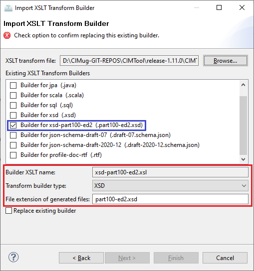

# xsd-part100-ed2.xsl

This builder currently ships with CIMTool.

## Builder Description

The **xsd-part100-ed2.xsl** builder is similar to the [xsd.xsl](../xsd-xsl/builder.md) builder in that it generates an XSD schema that is compliant with the [IEC 62361-100:2016 "CIM Profiles to XML Schema Mapping"](https://webstore.iec.ch/publication/25114) published standard. The **IEC 62361-100:2016** standard describes a mapping from CIM profiles to [W3C XML Schemas](https://www.w3.org/TR/xmlschema11-1/), intended to facilitate the exchange of information in the form of XML documents whose semantics are defined by the IEC CIM and whose syntax is defined by a W3C XML schema.

The XSD schemas generated by this builder, however, are uniquely compatible with the [IEC 61968-100:2022 "Implementation Profiles" Ed 2.0](https://webstore.iec.ch/publication/67766) published standard, which is no longer backwards compatible with **IEC 61968-100:2013**. Thus, the need for this builder is generating new XSD schemas compatible with **IEC 61968-100:2022**.

Again, refer to the [xsd.xsl](../xsd-xsl/builder.md) builder for generating XSD schemas compatible with [IEC 61968-100:2013 "Implementation Profiles" Ed 1.0](https://webstore.iec.ch/publication/6198).

## XSLT Version

This builder is XSLT 1.0 compliant.

## Author

Todd Viegut on behalf of UCAIug.

## Submission Date

20-Jun-2022

## Builder NTE Configuration

Given this builder ships with CIMTool the below screenshot highlights the existing NTE (Name/Type/Extension) settings for the builder.  We strongly recommend that you do not import customized versions of this shipped builder over the original in your local CIMTool installation. Doing so will force regeneration of any existing builder-generated artifacts for projects in your workspace that have this builder enabled.

The recommended best practice is to rename the builder file (from ```xsd-part100-ed2.xsl``` to ```custom-xsd-part100-ed2.xsl``` for example) before importing. On import this will be interpreted as a new builder and you will be allowed to enter values in the Type and Extension fields.

>*NOTE: </br>CIMTool requires that file extensions be unique and will prevent you from entering an extension already assigned to a builder. This is because an artifact's name is derived by concatenating the base name of the CIMTool ```.owl``` profile with the file extension assigned to the builder. Therefore, a unique file extension must be assigned to each builder when imported. The file extension for a builder can be modified later from with the "Maintain XSLT Transform Builders" screen.*



## License

This builder is released under the [Apache 2.0](/../LICENSE) license and was developed under sponsorship of the UCAIug.
